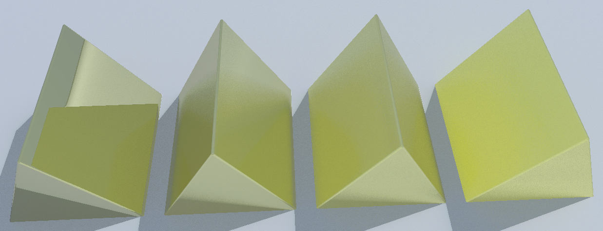
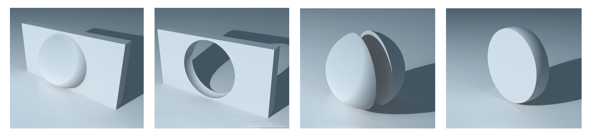
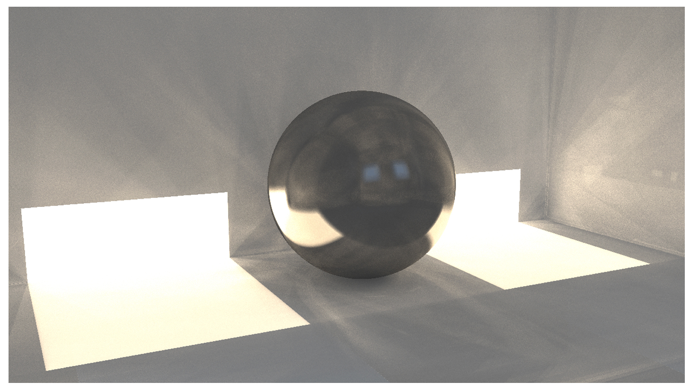
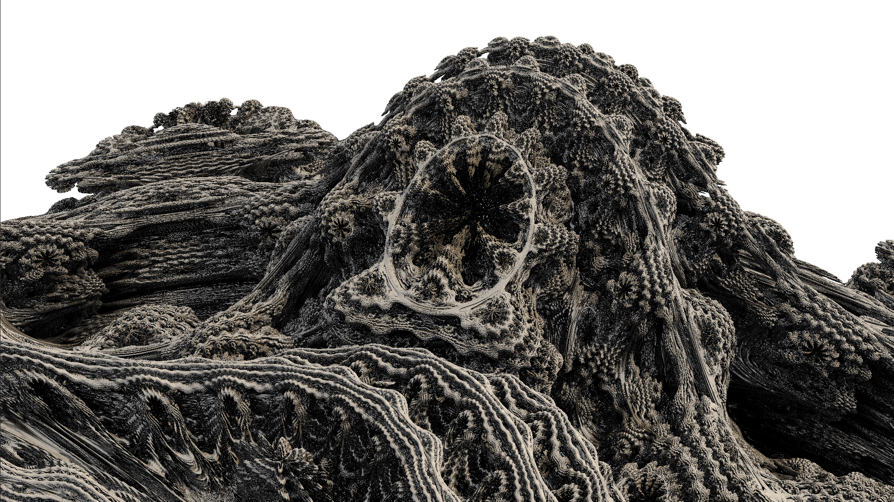

# Path marcher

Path marcher is a real-time GPU-accelerated path tracer that uses the ray marching technique in order to compute intersections with scene objects.

The application is built using C++, OpenGL and GLSL.

The path tracing rendering engine is implemented on the fragment shader. Furthermore, the system implements a simple denoising shader in order to tone down the amount of noise in the output in real time.

## Geometry and materials supported


This rendering application supports more than simple solid geometry: it allows the path tracing of signed distance functions. This means that you can explore and generate cool three-dimensional fractal renders as well!



Furthermore, it implements diffuse, specular and refractive materials, and even allows for the union, intersection and subtraction combinations of geometry.








# Compiling and Running - For programmers

In order to compile and run, run the following command in your console according to your operating system:

## Building on Linux

### Dependencies

- Make sure you have the latest legacy drivers installed for you graphics card.

Install the following dependencies on your machine:

**SDL2** - *Cross-platform development library designed to provide low level access to audio, keyboard, mouse, joystick, and graphics hardware via OpenGL and Direct3D*
```
sudo apt-get install libsdl2-dev
```

**GLEW** - OpenGL extension manager
```
sudo apt-get install libglew-dev
```

### Compiling and Running

If you are using Visual Studio Code, it is as simple as pressing Ctrl + Shift + B to run the compilation and run tasks consecutively.

To compile:
```
g++ -g \*.cpp -I include/ -Llib -lGLEW -lSDL2main -lSDL2 -o main.cpp.out -lOpenGL
```
To run:
```
./main.cpp.out
```

## Building on Windows

### Dlls and Mingw

In order to build this base application on windows you need to first move the files in the `dlls` directory to the root folder of the application.

You also need to install the mingw compiler in your machine and set its `bin` folder path on the global environment PATH variable.

### Compiling and Running

You are now ready to compile and run the application. If you are using Visual Studio Code, there is already a task available that compiles and runs the code consecutively if you press the Ctrl + Shift + B key combination inside VScode.

If you are using another code editor, please refer to the next commands (assuming you are running windows powershell):

To compile:
```
g++ -g \*.cpp -I include\\ -Llib -lglew32s -lSDL2main -lSDL2 -o main.cpp.exe -lopengl32
```
To run:
```
.\\main.cpp.exe
```
