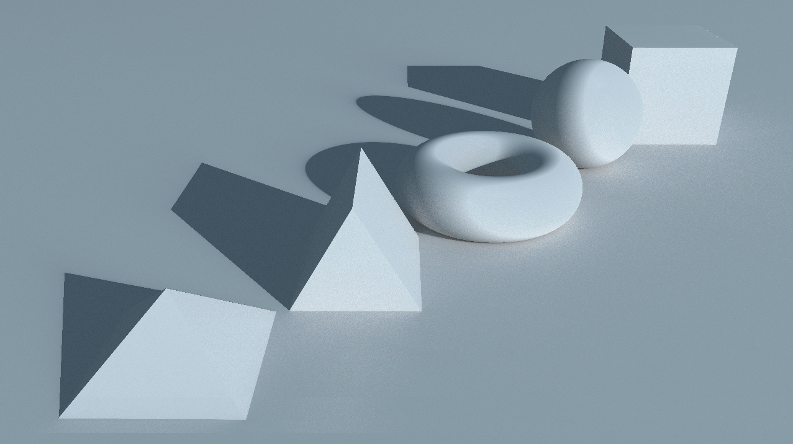

# Path marcher

Path marcher is a real-time GPU-accelerated path tracer that uses the ray marching technique in order to compute intersections with scene objects.

The application is built using C++, OpenGL and GLSL.

The path tracing rendering engine is implemented on the fragment shader. Furthermore, the system implements a simple denoising shader in order to tone down the amount of noise in the output in real time.

## Geometry and materials supported



This rendering application supports more than simple solid geometry: it allows the path tracing of signed distance functions. This means that you can explore and generate cool three-dimensional fractal renders as well!


Furthermore, it implements diffuse, specular and refractive materials, and even allows for the union, intersection and subtraction combinations of geometry.


# Compiling and Running - For programmers

In order to compile and run, run the following command in your console according to your operating system:

## Windows users:
```
g++ -g *.cpp -I include\\ -Llib -lglew32s -lSDL2main -lSDL2 -o fractals.exe -lopengl32
```
## Linux users:
```
g++ -g *.cpp -I include/ -Llib -lGLEW -lSDL2main -lSDL2 -o fractals.out -lOpenGL
```

Note: While the windows libraries are all included in this project, you will need to install those refered in the command for linux system if you are running this on linux. These are GLEW, SDL2 and OpenGL.

Alternatively, you can also compile and run in a simpler manner if you are running Visual Studio Code. Just open the project on VSCode and press CTRL+Shift+B. This will run an automated task to compile and run the project immediately.
